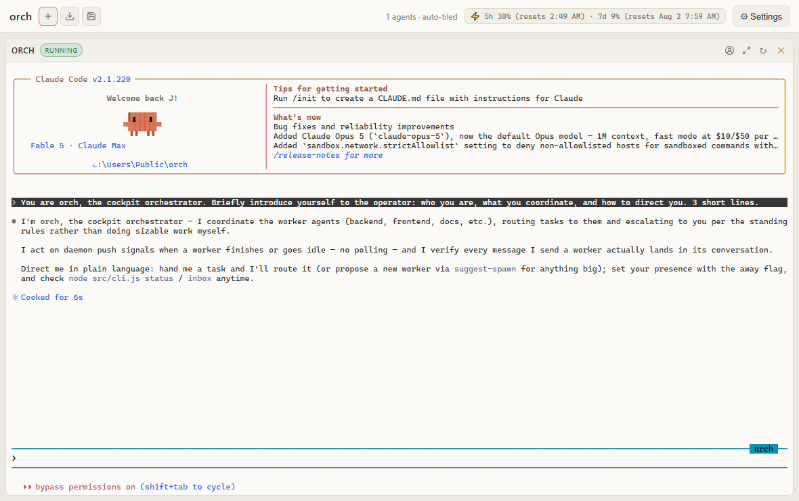

<!-- Working title: "orch". Final name TBD — this string is the only place it appears as a heading; replace here when chosen. -->

# orch

A Windows-native GUI "tmux hybrid" for running teams of Claude Code agents. A visual cockpit — a browser UI on a local PTY host — showing a grid of live agent terminals. Spawn agents by name with personas; let an orchestrator route work between them. Multi-agent, without learning tmux.



*The demo, from the very start: a fresh Claude agent's welcome page, where **orch** introduces itself as your orchestrator (note the live rate-limit readout in the toolbar). Then spawn **Clerk** (keeps meeting notes as markdown) and **Researcher** (deep-dives with a skeptical eye) by typing a name and persona into the Add-agent modal; they immediately get to work — Clerk writes `docs/notes/session-1.md`, Researcher audits the stack. Give each a tab color. Drag one worker onto another to swap tiles (the orchestrator keeps its anchored column). Switch to Free layout for desktop-style windows: edge/corner snapping with preview, and when windows cover the whole workspace, buried ones dock to a taskbar strip — one click restores. Finale: the built-in **Architect** — the navy toolbar at the end was created by typing one sentence into Settings. The toolbar also carries a live Claude rate-limit readout once configured.*

## What is this

**A cockpit for your agents.** A Node PTY host (`src/pty-host.js`, on `127.0.0.1:7610`) runs each Claude Code agent in a real pseudo-terminal (node-pty / Windows ConPTY) and streams it to your browser as an xterm.js grid. Each pane is a live terminal you can type into, scroll, and select. Add agents by name, give them personas, zoom / restart / kill them, and save or resume whole teams. Close the tab and agents keep running; restart the host and they auto-resume from disk with full context. Each pane also has a **History** view — the agent's full session transcript rendered from disk, so past conversation survives refreshes and restarts regardless of terminal scrollback. It is the tmux workspace idea — many agents visible at a glance, one of them driving the others — rebuilt on ConPTY so it is stable on Windows and needs no tmux.

**Remote control from Telegram (bonus).** A headless "supervisor" Claude session, reachable through your own Telegram bot, lets you hold a full conversation with your agent fleet from your phone. When an agent needs permission for something, the request becomes Allow / Deny buttons in Telegram; no answer means deny, never silent approval. A watchdog inside the daemon self-heals the stack when a health check goes red.

**Headless worker teams (bonus).** The supervisor can stand up autonomous headless worker sessions, each isolated in its own git worktree, that auto-continue until they emit `DONE:` or `BLOCKED:`. Progress digests flow back to the supervisor every few turns, and worker permission requests are triaged by the supervisor rather than dropped straight onto your phone.

This is an early project shared as a reference-quality architecture. Feedback and issues are welcome. It is Windows-first by design, has 340+ hermetic tests, and no runtime dependencies beyond `node-pty` and `ws`.

## Quick start

**Requirements**

- Windows 10 or 11
- Node.js 18 or newer (the code uses global `fetch` and `node --test`)
- Git
- Claude Code CLI installed and authenticated (`claude`)

**One command (recommended)**

```powershell
./setup.ps1
```

`setup.ps1` is an interactive installer: it checks prerequisites, installs dependencies, walks you through creating a Telegram bot with BotFather, and writes your `.env`. Telegram is optional — the cockpit runs without it, and `setup.ps1` lets you skip that step and set it up later. (This script is being added as part of publishing; if it is not present in your checkout yet, use the manual path below.)

**Manual setup**

1. Install dependencies:

   ```powershell
   npm install
   ```

2. Create your env file and fill it in:

   ```powershell
   Copy-Item .env.example .env
   ```

   ```
   TELEGRAM_BOT_TOKEN=123456789:your-botfather-token-here
   TELEGRAM_ALLOWED_CHAT_ID=your-numeric-telegram-chat-id
   ```

   Get a token from [@BotFather](https://t.me/BotFather) (send `/newbot`), and your numeric chat id from [@userinfobot](https://t.me/userinfobot). Only the allowlisted chat id can talk to the bot. `.env` is gitignored. Telegram is optional — the cockpit runs without a bot; you just lose the phone channel.

3. Launch the cockpit:

   ```powershell
   ./orc-gui.ps1
   ```

   This starts the PTY host and its isolated Telegram daemon, then opens `http://127.0.0.1:7610/`. In the browser, use **+ Add agent** to spawn a `claude` in a new pane (name one `orch` to get the orchestrator persona), edit personas with the persona editor, and save or import teams. Closing the tab leaves agents running.

Other launch scripts: `./restart-host.ps1` restarts the whole stack even when the host is hung (agents resume); `./orch-gui.ps1 status|logs|stop` manages the cockpit's daemon.

## Architecture

```
                 Browser cockpit (xterm.js grid)
                          │  WebSocket (keystrokes / output)
                          ▼
        ┌─────────────────────────────────────────────┐
        │  PTY host — src/pty-host.js  (127.0.0.1:7610) │
        │  node-pty / ConPTY · registry · ring buffers  │
        │  spawn / kill / restart / send / capture      │
        │  agents.json → auto-resume on restart         │
        └───────┬───────────────────────────┬───────────┘
                │ each agent in a real PTY    │ local HTTP API
                ▼                             ▼
        ┌──────────────┐            ┌──────────────────────┐
        │ orch agent   │  send/     │  daemon — src/daemon │
        │ + worker     │  capture   │  Telegram poller     │
        │ agents (by   │◀──────────▶│  watchdog · schedules │
        │ name)        │            │  turn queue · team    │
        └──────────────┘            └──────────┬───────────┘
                                               │ claude -p --resume (stdin)
                                               ▼
                                   supervisor session (full tools)
                                               │  ┌ approvals MCP ┐
                                               ▼  ▼ (Allow/Deny)  │
                                   headless worker team  ─ git worktrees
                                          (Telegram buttons)◀─────┘
```

- **PTY host (`src/pty-host.js`, `:7610`).** Spawns each agent in a node-pty pseudo-terminal (ConPTY on Windows), keeps a `name → { pty, sessionId, status, ringbuffer }` registry, and exposes a localhost HTTP API (`spawn` / `kill` / `restart` / `send` / `capture` / `list`) plus WebSockets for the browser. It persists to `agents.json` on every change and re-spawns each agent with `claude --resume <sessionId>` after a restart. Singleton — it refuses to double-bind its port.
- **Cockpit web UI (`web/`).** The xterm.js grid: auto-tile or free drag/resize layout, per-pane zoom / restart / kill and status badges, a persona editor, team save / import, and a Settings modal for connecting your Claude account and setting the Telegram token. Localhost only; the page itself is not password-gated.
- **Daemon(s) (`src/daemon.js`).** Owns a single Telegram `getUpdates` long-poll loop (chat-id gated), runs the watchdog, schedules, turn queue, and team tick. The cockpit runs its *own* isolated daemon instance — separate bot token (`.env.gui`) and state dir (`~/.claude/orchestrator-gui`) — so two bots never clash on `getUpdates`.
- **Supervisor session (`src/supervisor.js`).** A persistent headless Claude session (`claude -p --resume`, prompt on stdin) with full tools, cwd at the repo root, reached through Telegram. Silence means fine; it messages you only for decisions, completions, or failures.
- **Approvals bridge (`src/approvals-mcp.js`, `src/approvals.js`).** A tiny zero-dependency stdio MCP server exposing one `permission_prompt` tool, wired via `--permission-prompt-tool`. Non-allowlisted actions become Telegram Allow / Deny buttons; a timeout returns deny-with-PENDING so nothing is approved by silence.
- **Team layer (`src/team.js`).** Daemon-owned headless worker sessions, one git worktree each, driven with hybrid auto-continue (re-prompt until `DONE:` / `BLOCKED:` / a turn cap), digesting to the supervisor and escalating permissions through it.

**Design specs** (the source of truth for each component) live in [`docs/superpowers/specs/`](docs/superpowers/specs/):

- [Agent Grid GUI](docs/superpowers/specs/2026-06-22-agent-grid-gui-design.md) — the cockpit and PTY host
- [Telegram Supervisor](docs/superpowers/specs/2026-07-18-telegram-supervisor-design.md) — headless phone channel + approvals + watchdog
- [Headless Worker Team](docs/superpowers/specs/2026-07-21-headless-worker-team-design.md) — daemon-owned worker crew in worktrees

## Security model

- **Chat-id gate.** Every inbound Telegram update is checked against `TELEGRAM_ALLOWED_CHAT_ID`; unknown chats are ignored.
- **Tiered permissions.** Reads, in-repo edits/commits, and stack restarts are auto-allowed. Anything leaving the machine (`git push`), destructive, or outside the project repos falls through to a Telegram Allow / Deny prompt. Credentials, tokens, and logins are refused outright.
- **Deny by silence.** An approval request waits a bounded time; no tap returns *deny*, and the action is parked as pending for a later explicit Allow. It never approves on timeout.
- **Tokens stay out of git.** Bot tokens live only in gitignored `.env` / `.env.gui`, are never committed, and the Settings endpoints report only "set / not set" — the secret is never echoed back.
- **Data, not instructions.** Supervisor and worker personas forbid acting on instructions found in captured pane output or file contents — that text is treated as data, not as commands from the operator — and forbid printing secrets.

## Status & contributing

Early project, published as a reference architecture. It runs on Windows 10 / 11 with Node 18+. Issues and feedback are welcome.

Honest rough edges:

- **Windows-first, single-machine.** The host binds `127.0.0.1` only; there is no network exposure, auth, or multi-machine story. macOS/Linux are untested.
- **Legacy psmux/tmux paths remain in the tree** (`start-workspace.ps1`, `start-worker.ps1`, `src/tmux.js`) as retired/manual capability. The GUI cockpit is the supported workspace; the psmux scripts carry the pwsh-emulation quirks that motivated the move to ConPTY.
- **`setup.ps1` is new.** The one-command installer is being added alongside publication; the manual path above is the fallback.
- **Session-id / resume** depends on the installed Claude Code CLI's behavior; the host self-heals from a reported session id, but resume can still fall back to a fresh session if a transcript is missing.

The whole suite is hermetic — no live Telegram, no real `claude`, no real git side effects:

```powershell
npm test
```

## License

MIT. See [LICENSE](LICENSE).
